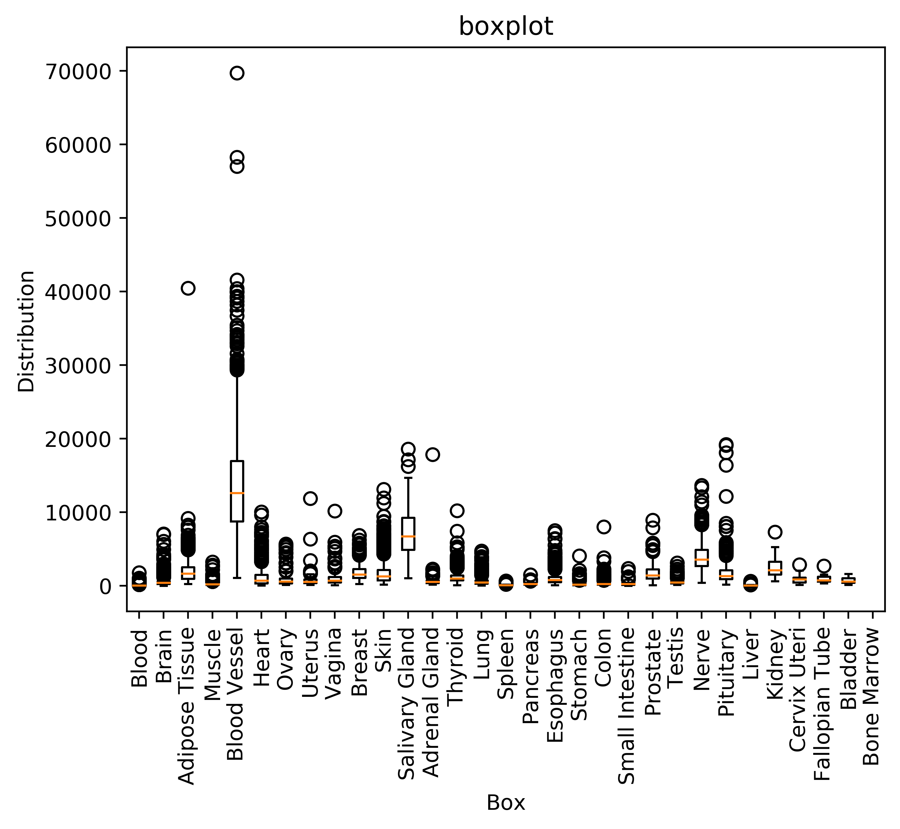

# Parallel-arrays-profiling-and-benchmarking
[](https://travis-ci.com/cu-swe4s-fall-2019/parallel-arrays-profiling-and-benchmarking-chzh1418)

Parallel Arrays, Profiling, and Benchmarking
Users must download those files for scripts to run successfully.
Files:
- https://github.com/swe4s/lectures/blob/master/data_integration/gtex/GTEx_Analysis_2017-06-05_v8_RNASeQCv1.1.9_gene_reads.acmg_59.gct.gz?raw=true
- https://storage.googleapis.com/gtex_analysis_v8/rna_seq_data/GTEx_Analysis_2017-06-05_v8_RNASeQCv1.1.9_gene_reads.gct.gz
- https://storage.googleapis.com/gtex_analysis_v8/annotations/GTEx_Analysis_v8_Annotations_SampleAttributesDS.txt

## Usage
To get the boxplot, user can use the following commands
```
python plot_gtex.py --gene_name FOXC1 --gene_reads GTEx_Analysis_2017-06-05_v8_RNASeQCv1.1.9_gene_reads.gct.gz --group_type SMTS --sample_attributes GTEx_Analysis_v8_Annotations_SampleAttributesDS.txt --outfile_name Foxc1.png
```
To use hash table, use the following commands
```
python plot_gtex1.py --gene_name FOXC1 --gene_reads GTEx_Analysis_2017-06-05_v8_RNASeQCv1.1.9_gene_reads.gct.gz --group_type SMTS --sample_attributes GTEx_Analysis_v8_Annotations_SampleAttributesDS.txt --output_file Foxc1_hash.png
```

To do unittest
```
python unit_test_plot_gtex.py
```

To do functional test
```
chmod +x functional_test.sh
. functional_test.sh
```

## Profiling
To get the profiling of linear search and binary search, I used cProfile to run two tests separately. The output is written in file 'plot_gtex.linear_serach.txt' and 'plot_gtex.binary_search.txt'.

For linear search, the linear search is taken up the most of the running time, 24.877seconds. 

For binary search, the sorting operation took up most of the operating time, 20.616seconds. But the binary search only took 0.182 seconds total.

Overall binary search performs better than linear search.

## Benchmarking
For benchmarking, the time module can give the running time of each steps. The output of linear and binary search is stored in file 'linear_benchmarking.txt' and 'binary_benchmarking.txt'.
```
For linear search
	* Searching time : 24.297484874725342
	* main prog running time: 77.3324408531189
```
```
For binary search
	* Sorting time: 15.189553022384644
	* Searching time : 0.11153340339660645
	* main prog running time: 64.91340494155884
```
```
For hash table
	* main prog running time 20.657002925872803
```
